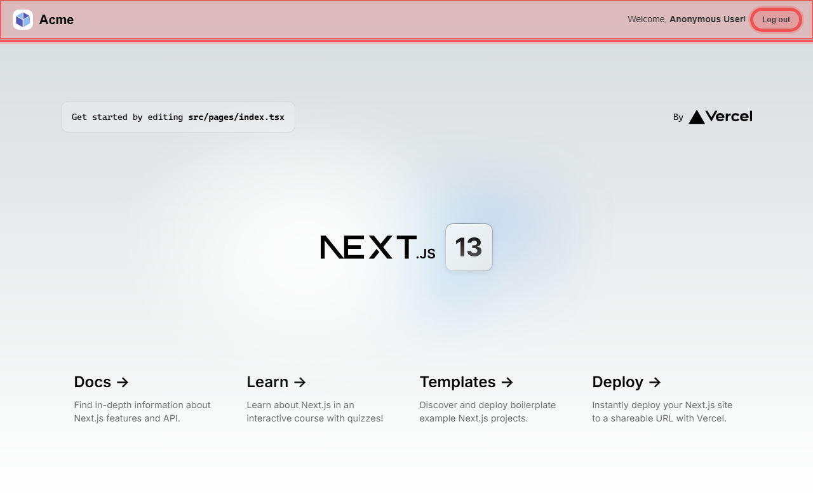

# Web Automation

Collection of scripts for automating web test related tasks.

## Highlight

`highlight.ts` ([Source](highlight.ts))

This script generates a screenshot capture a webpage and highlights any elements associated with one or more classes. Regular Expressions can be used for class names (e.g. `--class ^prefix-.+`)

```sh
yarn run-script bin/web-automation/highlight.ts --url [url] --class [class-one] --class [class-two]
```

(e.g `yarn run-script bin/web-automation/highlight.ts --url https://vite-storybook-boilerplate-next-app.psychobolt.vercel.app  --class ^storybook-.+`)



### Options

- `--parent [parent-class]`: Scope findings to elements within a parent class.
- `--output [file-path]`: Specify custom output screenshot file name (default: `.temp/highlighted-elements.png`).
- `--color [color]`: Highlight color, accepts hex (e.g. `#00ff00`) or RGB (e.g. `0,255,0`).
- `--border-alpha [alpha]`: Set border highlight opacity (default: `0.5`).
- `--class [regex]`: Class names can be regular expressions (e.g. `--class ^prefix-.+`).

## Inventory

`inventory.ts` ([Source](inventory.ts))

**Prerequisites**: A storybook project integrtated with [Visual Test Addon](https://storybook.js.org/addons/@chromatic-com/storybook).

[Chromatic](https://www.chromatic.com/) is a Visual Testing platform which scans changes with your UI components in Storybook. This script can be executed to download Chromatic snapshots to the project after starting or deploying Storybook. Snapshots are saved to the relative `__snapshots__` folder in the component source directories.

```sh
yarn [workspace workspace-name] g:build-inventory --storybook-url [url]
```
